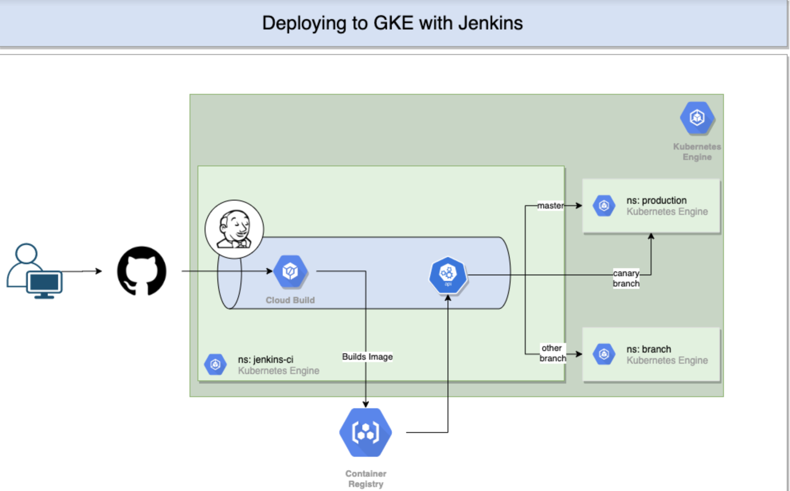

# Continuous Deployment of a Two Tiered Application to GKE

This file walks through how to deploy a Jenkins in Google Kubernetes Engine (GKE). The Jenkins can then be used to 
continuously integrate (CI) and deploy (CD) a two tired application consisting of a SpringBoot API and an Angular 
front end.

## Architecture



#### Notes:
- Frontend and backend are built in two separate build steps. 
- Jenkins doesn't have to be hosted in same GKE cluster. Could be in a separate GKE instance or completely different
environment (e.g. Fabric)
- Canary release creates a second pod in production namespace and routes a % of the traffic to it.
- Pushing to a branch creates a new kubernetes namespace
    - Branch should not have `/` in the name
   

### Issues / Still to do
- [ ] Connect database
- [ ] Have not been able to link frontend with backend, so they cannot communicate. This is either a k8s or nginx (or both)
miss-configuration.
    - Was able to connect the two locally when using the non-production environment file in angular. 
    - How to connect frontend pod to backend pod using the services? 
- [ ] Deploy between different projecs (to mimic DEV/UAT/PROD set up)
- [ ] Test if deleting a branch also deletes the namespace in GKE

### Next steps
- Compare with use of Spinniker 
- Split CI and CD into two sepsrate processes. CD is more important than CI, don't care as much about how team produces
the image.

## Setting up CI/CD in Jenkins
### Setting up your environment
Export these variables to make your life easier. 

````
export PROJJECT=[PROJECT-NAME]
export ZONE=europe-west1-b
````

### Configure Service Account for Jenkins
Create a service account for Jenkins and grant it necessary roles, these are:
 
 - Source Reader
 - Viewer
 - Storage Admin
 - Storage Object Admin
 - Container Developer
 - Cloud Build Editor

Then export the service account to a JSON key file from cloud shell and download it to your local machine.

````
gcloud iam service-accounts create jenkins-sa --display-name "jenkins-sa"

gcloud projects add-iam-policy-binding $PROJECT \
    --member "serviceAccount:jenkins-sa@$PROJECT.iam.gserviceaccount.com" \
    --role "roles/source.reader"

gcloud projects add-iam-policy-binding $PROJECT \
    --member "serviceAccount:jenkins-sa@$PROJECT.iam.gserviceaccount.com" \
    --role "roles/viewer"

gcloud projects add-iam-policy-binding $PROJECT \
    --member "serviceAccount:jenkins-sa@$PROJECT.iam.gserviceaccount.com" \
    --role "roles/storage.admin"

gcloud projects add-iam-policy-binding $PROJECT \
    --member "serviceAccount:jenkins-sa@$PROJECT.iam.gserviceaccount.com" \
    --role "roles/storage.objectAdmin"

gcloud projects add-iam-policy-binding $PROJECT \
    --member "serviceAccount:jenkins-sa@$PROJECT.iam.gserviceaccount.com" \
    --role "roles/cloudbuild.builds.editor"

gcloud projects add-iam-policy-binding $PROJECT \
    --member "serviceAccount:jenkins-sa@$PROJECT.iam.gserviceaccount.com" \
    --role "roles/container.developer"

gcloud iam service-accounts keys create ~/jenkins-sa-key.json \
    --iam-account "jenkins-sa@$PROJECT.iam.gserviceaccount.com"
````

### Create a Kubernetes Cluster 
This will run both Jenkins and your application.

> *NOTE:* The below command didnt work, so I just used the portal. 

````
gcloud container clusters create jenkins-cd \
    --zone $ZONE \
    --num-nodes 2 \
    --machine-type n1-standard-2 \
    --cluster-version latest \
    --service-account "jenkins-sa@$PROJECT.iam.gserviceaccount.com"

gcloud container clusters get-credentials jenkins-cd --zone europe-west1-b

kubectl cluster info
````

Add yourself as a cluster admin in the clusters RBAC:
````
kubectl create clusterrolebinding cluster-admin-binding \
    --clusterrole=cluster-admin \
    --user=$(gcloud config get-value account)
````

### Install Helm

We will use Helm to download Jenkins into our Kubernetes cluster.

````
wget https://get.helm.sh/helm-v3.2.1-linux-amd64.tar.gz
tar zxfv helm-v3.2.1-linux-amd64.tar.gz
cp linux-amd64/helm .
./helm repo add stable https://kubernetes-charts.storage.googleapis.com
./helm version
````

## Jenkins

### Installing 

Make sure there is a file under the path ``jenkins/values.yaml`` and run the below command.

````
./helm install cd-jenkins -f jenkins/values.yaml stable/jenkins --version 1.7.3 --wait
kubectl get pods
````
Give jenkins the cluster-admin role. This is required so that Jenkins can create Kubernetes namespaces and any other
resources that the app requires. For production use, you should catalog the individual permissions necessary and apply 
them to the service account individually.

````
kubectl create clusterrolebinding jenkins-deploy \
    --clusterrole=cluster-admin \
    --serviceaccount=default:cd-jenkins
````
Set up port forwarding using the below commands and then click the 'view in browser' button of the cloud shell.

> *NOTE:* This is annoying. You have to do this every time the cloud shell session ends and you want to get to the UI.
> Probably you can just create a service and give Jenkins an external IP?
````
export JENKINS_POD_NAME=$(kubectl get pods --namespace default -l "app.kubernetes.io/component=jenkins-master" -l "app.kubernetes.io/instance=cd-jenkins" -o jsonpath="{.items[0].metadata.name}") 

kubectl port-forward $JENKINS_POD_NAME 8080:8080 >> /dev/null & 

kubectl get svc
````
### <div id="connecting_to_jenkins">Connecting</div> 

Navigate to the Jenkins UI by connecting to port 8080 (command shell button). The username is ``admin`` and password
is retrieved using:
````
printf $(kubectl get secret cd-jenkins -o jsonpath="{.data.jenkins-admin-password}" | base64 --decode);echo
````

## Deploying the application

You will be deploying to 3 environments:
- *Production*  - The live site that your users access
- *Canary*      - A smaller capacity site that receives only a percentage of your user traffic.
- *Branch-Name* - A custom environment created for each branch

### Using Jenkins

### Set up the environment

> *NOTE:* Creating GKE/Database can be automated as infrastructure as code 
>(e.g. terraform scripts running in Cloud Build)

Make sure you have a GKE cluster running (which you will, since you have deployed Jenkins). 

#### Configure Jenkins

Navigate to the ``Jenkinsfile`` and change the environment variables (lines 3-12). Commit and push your changes.

Connect to the Jenkins UI as described in the <a href="#connecting_to_jenkins">connecting section</a> above. Create the 
Jenkins pipeline by following these steps:

1. Add Service Account
    - Navigate to Manage Jenkins -> Manage Credentials -> (global) 
    - Click "Add Credentials" in the left navigation
    - Select private key type `Google Service Account` 
    - Enter your GCP project name
    - Select the jenkins-sa-key.json key (if you can't see this, you have most likely miss-spelt the project name) 
    - Click OK
2. Create Pipeline Job
    - From the side menu navigate to Jenkins -> New Item 
    - Select Multibranch Pipeline and give it a Name
    - Under *Branch Sources* on the next page, select *Add Source* and then *git*
    - Point to wherever your source code 
        > *NOTE:* If its in a public github you wont need to provide an access credentials. If it's in your GCP project
        > you will need to add the key from step 1.
    - Under *Scan Multibranch Pipeline Triggers* select *Periodically if not Otherwise* and set the interval to 1 minute.
    - Save.
    
    
Push some code changes to master/a branch and Jenkins should do the rest.

To view your application, get the external IP for the demo-frontend service by either using the portal or 
`kubectl get svc -n production`
    
###  Manual Deployment
#### Build images with Docker

This will be automated as part of the build process with Jenkins, but if you need to manually build and push the images
to GCR you can use these commands.

````
cd demo-backend
docker build .
docker images #To Get the image ID
docker tag <IMAGE-ID> gcr.io/gke-travisci-deployment/demo-backend:1.0.0
docker push gcr.io/gke-travisci-deployment/demo-backend:1.0.0

cd ../demo-frontend
docker build .
docker images #To Get the image ID
docker tag <IMAGE-ID> gcr.io/gke-travisci-deployment/demo-frontend:1.0.0
docker push gcr.io/gke-travisci-deployment/demo-frontend:1.0.0
````

#### Deploy manually with Kubernetes 

Deploy the Kubernetes charts using the image we have just built. 

````
kube create namespace production

kubectl apply -n production -f k8s/production
kubectl apply -n production -f k8s/services
````

To view your application, get the external IP for the demo-frontend service by either using the portal or 
`kubectl get svc -n production`